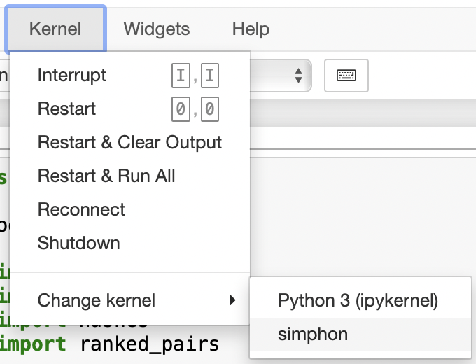

# simphon
Proof-of-concept for measuring similarity of phoneme sequences using locality sensitive hashing (LSH).

## Setup

Requires Python 3.10+

To install dependencies:

```zsh
$ python3 -m venv simphon
$ source simphon/bin/activate
(simphon) $ pip3 install -U pip
(simphon) $ pip3 install -r requirements.txt
```

To use the virtual environment in the Jupyter notebook, run:

```zsh
(simphon) $ ipython kernel install --user --name=ipa
(simphon) $ jupyter notebook simphon.ipynb
```

Then, choose the kernel with the name of the virtual environment:



## Using `simphon.py`

There is a CLI you can run from `simphon.py`:

```zsh
(simphon) $ ./simphon.py -h
usage: simphon.py [-h] [-n N_GRAMS_SIZE] [-b {32,64,128}] [-w WINDOW]

options:
  -h, --help            show this help message and exit
  -n N_GRAMS_SIZE, --n-grams-size N_GRAMS_SIZE
                        size n for n-grams (default: 3)
  -b {32,64,128}, --bits {32,64,128}
                        LSH bit size (default: 128)
  -w WINDOW, --window WINDOW
                        sliding window size for comparing LSH bitwise differences (default: 10)
```

Example output formatted with `tabulate`:

```zsh
(simphon) $ ./simphon.py -n 3 -b 128 -w 2 | tabulate -1s $'\t' -F '0.3f'   
ranking pairs by bitwise distances: 100%|███████████████████████████████████████████████████| 646/646 [00:00<00:00, 689445.39pair/s]
     a                                  b                                    simhash difference (in bits)    $$\sigma_{phonemic}$$
---  ---------------------------------  ---------------------------------  ------------------------------  -----------------------
  0  (eng) Zach /z æ k/                 (eng) Zak /z æ k/                                               0                    1.000
  1  (eng) Catherine /k æ θ ə r ə n/    (eng) Catherine /k æ θ ə r ɪ n/                                60                    0.766
  2  (eng) Jenny /d̠ʒ ɛ n i/             (eng) Johnny /d̠ʒ ɑ n i/                                        60                    0.766
  3  (eng) Brad /b ɹ æ d/               (eng) Brett /b ɹ ɛ t/                                          70                    0.727
  4  (eng) Carl /k ɑ ɹ l/               (eng) Carlos /k ɑ ɹ l oʊ s/                                    82                    0.680
  5  (eng) Alexi /ə l ɛ k s i/          (eng) Alexis /ə l ɛ k s ɪ s/                                   83                    0.676
  6  (eng) Jennifer /d̠ʒ ɛ n ə f ɚ/      (eng) Jonathan /d̠ʒ ɑ n ə θ ə n/                                88                    0.656
  7  (eng) Matt /m æ t/                 (eng) Nick /n ɪ k/                                             89                    0.652
  8  (eng) Jennifer /d̠ʒ ɛ n ə f ɚ/      (eng) Johnny /d̠ʒ ɑ n i/                                        89                    0.652
  9  (eng) Catherine /k æ θ ə r ə n/    (eng) Zachary /z æ k ə r i/                                    90                    0.648
 10  (eng) Catherine /k æ θ ə r ə n/    (eng) Tyler /t aɪ l ə r/                                       90                    0.648
 11  (eng) Kat /k æ t/                  (eng) Zach /z æ k/                                             90                    0.648
 12  (eng) Carl /k ɑ ɹ l/               (eng) Zach /z æ k/                                             90                    0.648
 13  (eng) Catherine /k æ θ ə r ɪ n/    (eng) Tyler /t aɪ l ə r/                                       90                    0.648
 14  (eng) Kat /k æ t/                  (eng) Zak /z æ k/                                              90                    0.648
 15  (eng) Alex /æ l ə k s/             (eng) Alexi /ə l ɛ k s i/                                      91                    0.645
 16  (eng) Catherine /k æ θ ə r ɪ n/    (eng) Zachary /z æ k ə r i/                                    92                    0.641
 17  (eng) Catherine /k æ θ ə r ə n/    (eng) Nathan /n eɪ θ ə n/                                      92                    0.641
 18  (eng) Carl /k ɑ ɹ l/               (eng) Zak /z æ k/                                              92                    0.641
...
```
